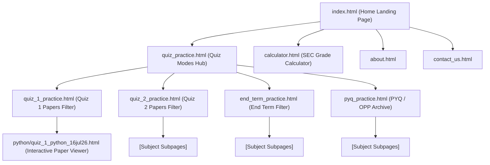

# 🧠 BSH Project Neural Network & Architecture Map

> **Instruction for AI & Developers**: Always consult this file first before making any code modifications. It contains the complete architectural graph, file responsibilities, data structures, and task protocols for the **BSH (BS Students Helper)** portal.

---

## 🕸️ 1. Project Routing & Navigation Graph



---

## 📁 2. File-to-Function Directory & Responsibilities

### 📄 Root HTML Pages
| File Path | Description & Key Responsibilities | Key Symbols / JS Objects |
| :--- | :--- | :--- |
| [`index.html`](file:///c:/Users/Atanu%20Das/OneDrive/Desktop/self%20project/bsh/index.html) | Main Landing Page. Features overview, SEO Metadata, Google Sitelinks Search Box Schema, OpenGraph tags. | `#header`, `#announcementBar`, `JSON-LD Graph` |
| [`quiz_practice.html`](file:///c:/Users/Atanu%20Das/OneDrive/Desktop/self%20project/bsh/quiz_practice.html) | Quiz Modes Selection Hub. Cards leading to Quiz 1, Quiz 2, End Term, and PYQ practice pages. | `.quiz-mode-card` |
| [`quiz_1_practice.html`](file:///c:/Users/Atanu%20Das/OneDrive/Desktop/self%20project/bsh/quiz_1_practice.html) | Quiz 1 Question Papers Library. Flat borderless layout with course & year filters. | `QUIZ1_PAPERS`, `#courseSelect`, `#yearSelect`, `#papersGrid`, `renderPapers()` |
| [`quiz_2_practice.html`](file:///c:/Users/Atanu%20Das/OneDrive/Desktop/self%20project/bsh/quiz_2_practice.html) | Quiz 2 Question Papers Library. Flat borderless layout with course & year filters. | `QUIZ2_PAPERS`, `#courseSelect`, `#yearSelect`, `#papersGrid`, `renderPapers()` |
| [`end_term_practice.html`](file:///c:/Users/Atanu%20Das/OneDrive/Desktop/self%20project/bsh/end_term_practice.html) | End Term Question Papers Library. Flat borderless layout with course & year filters. | `ENDTERM_PAPERS`, `#courseSelect`, `#yearSelect`, `#papersGrid`, `renderPapers()` |
| [`pyq_practice.html`](file:///c:/Users/Atanu%20Das/OneDrive/Desktop/self%20project/bsh/pyq_practice.html) | PYQ & OPPE Papers Archive. Flat borderless layout with course & year filters. | `PYQ_PAPERS`, `#courseSelect`, `#yearSelect`, `#papersGrid`, `renderPapers()` |
| [`calculator.html`](file:///c:/Users/Atanu%20Das/OneDrive/Desktop/self%20project/bsh/calculator.html) | SEC Grade Calculator Page. Interactive calculator for IITM BS courses. | `#calculatorForm`, `calculateGrade()` |
| [`about.html`](file:///c:/Users/Atanu%20Das/OneDrive/Desktop/self%20project/bsh/about.html) | About BSH community portal and student team. | Sections for vision and team |
| [`contact_us.html`](file:///c:/Users/Atanu%20Das/OneDrive/Desktop/self%20project/bsh/contact_us.html) | Contact and feedback submission form. | `#contactForm` |
| [`404.html`](file:///c:/Users/Atanu%20Das/OneDrive/Desktop/self%20project/bsh/404.html) | Custom 404 Not Found error page. | Back to Home CTAs |

### 🐍 Subject Subfolder (`/python/`)
| File Path | Description & Key Responsibilities | Key Symbols / JS Objects |
| :--- | :--- | :--- |
| [`python/quiz_1_python_16jul26.html`](file:///c:/Users/Atanu%20Das/OneDrive/Desktop/self%20project/bsh/python/quiz_1_python_16jul26.html) | Interactive Exam Viewer for Python Quiz 1 (16 Jul 2026). Exam & Learning modes, live score calculator, modal summaries, timer. | `QUESTIONS`, `userAnswers`, `setPortalMode()`, `openSummaryModal()`, `submitExam()` |
| [`python/index.html`](file:///c:/Users/Atanu%20Das/OneDrive/Desktop/self%20project/bsh/python/index.html) | Redirect / index helper for Python papers directory. | Directory index |

### 🎨 Styles & JavaScript (`/assets/`)
| File Path | Description & Key Responsibilities | Key Symbols / JS Objects |
| :--- | :--- | :--- |
| [`assets/css/style.css`](file:///c:/Users/Atanu%20Das/OneDrive/Desktop/self%20project/bsh/assets/css/style.css) | Core Design System. Theme CSS Variables (`--bg-dark`, `--text-primary`, `--border-color`), Navbar, Footer, Modals, Badges. | `:root`, `[data-theme="dark"]`, `.hero-section`, `.modal-overlay` |
| [`assets/css/calculator.css`](file:///c:/Users/Atanu%20Das/OneDrive/Desktop/self%20project/bsh/assets/css/calculator.css) | Calculator-specific styling and form input layouts. | `.calc-card`, `.grade-result` |
| [`assets/js/main.js`](file:///c:/Users/Atanu%20Das/OneDrive/Desktop/self%20project/bsh/assets/js/main.js) | Global site logic. Dark/light theme toggle, mobile navbar drawer, header sticky observer, and `[data-coming-soon]` click handler. | `toggleTheme()`, `initComingSoonModal()` |
| [`assets/js/calculator.js`](file:///c:/Users/Atanu%20Das/OneDrive/Desktop/self%20project/bsh/assets/js/calculator.js) | Formula engine and course grade calculations. | `COURSES_DATA`, `computeSEC()` |

### 🌐 SEO & Deployment Configs
| File Path | Description & Key Responsibilities |
| :--- | :--- |
| [`sitemap.xml`](file:///c:/Users/Atanu%20Das/OneDrive/Desktop/self%20project/bsh/sitemap.xml) | XML Sitemap containing all site URLs for Google Search indexing. |
| [`robots.txt`](file:///c:/Users/Atanu%20Das/OneDrive/Desktop/self%20project/bsh/robots.txt) | Web crawler rules allowing Googlebot and specifying `sitemap.xml` path. |
| [`vercel.json`](file:///c:/Users/Atanu%20Das/OneDrive/Desktop/self%20project/bsh/vercel.json) | Vercel deployment configuration, clean URL rewrites, and static header caching. |

---

## 🛠️ 3. Execution Protocols & Step-by-Step Task Workflows

When performing any task on this repository, follow these precise protocol steps:

### 📌 Protocol A: Adding or Updating Question Papers
1. **Create/Update Paper HTML File**:
   - Place the interactive HTML paper in the appropriate subject directory (e.g. `python/quiz_1_python_16jul26.html`).
2. **Update Paper Registry Array**:
   - In the target practice page ([`quiz_1_practice.html`](file:///c:/Users/Atanu%20Das/OneDrive/Desktop/self%20project/bsh/quiz_1_practice.html), [`quiz_2_practice.html`](file:///c:/Users/Atanu%20Das/OneDrive/Desktop/self%20project/bsh/quiz_2_practice.html), [`end_term_practice.html`](file:///c:/Users/Atanu%20Das/OneDrive/Desktop/self%20project/bsh/end_term_practice.html), or [`pyq_practice.html`](file:///c:/Users/Atanu%20Das/OneDrive/Desktop/self%20project/bsh/pyq_practice.html)), locate the paper array (`QUIZ1_PAPERS`, `QUIZ2_PAPERS`, `ENDTERM_PAPERS`, or `PYQ_PAPERS`).
   - Add/update the object:
     ```js
     {
       id: "python_1",
       course: "python",
       title: "Quiz 1 - 16 Jul 2026",
       year: 2026,
       term: "May 2026 Term",
       questions: 10,
       time: "45 mins",
       url: "python/quiz_1_python_16jul26.html" // relative path
     }
     ```
   - **Crucial Rule**: Ensure `url` points to an actual file. If `url` is set to `#` or empty, `renderPapers()` will automatically attach `data-coming-soon="Paper viewer launching soon"`.
3. **Update XML Sitemap**:
   - Add the new paper URL to [`sitemap.xml`](file:///c:/Users/Atanu%20Das/OneDrive/Desktop/self%20project/bsh/sitemap.xml).

---

### 📌 Protocol B: Styling & Design System Rules
1. **Design Aesthetics**:
   - Maintain the flat, borderless design across all practice pages.
   - Do **NOT** wrap toolbar filter rows or empty states in outer card boxes or add fuzzy background glow blobs (`.hero-glow-blob`).
   - Keep `box-shadow: none` on practice toolbar boxes and empty state containers.
   - Use `assets/images/empty.png` for empty selection states.
2. **Theme System**:
   - Always verify styling in both **Light Mode** (`:root`) and **Dark Mode** (`[data-theme="dark"]`).
   - Always use CSS variables (`var(--bg-dark)`, `var(--text-primary)`, `var(--border-color)`, `var(--accent-purple)`).

---

### 📌 Protocol C: Global Interception & JavaScript Rules
1. **Coming Soon Modal Handler**:
   - [`assets/js/main.js`](file:///c:/Users/Atanu%20Das/OneDrive/Desktop/self%20project/bsh/assets/js/main.js#L568) listens globally to clicks on elements with `[data-coming-soon]`.
   - If `[data-coming-soon]` is present on an element, `main.js` cancels default click behavior (`e.preventDefault()`) and opens the coming-soon popup.
   - To make a link open normally, ensure `data-coming-soon` attribute is NOT present on the anchor tag.

---

## 🔍 4. Quick File Location Checklist

- 🎯 **Modifying Main Header/Footer**: Edit [`assets/css/style.css`](file:///c:/Users/Atanu%20Das/OneDrive/Desktop/self%20project/bsh/assets/css/style.css) and template blocks in `.html` files.
- 🎯 **Adding/Fixing Quiz 1 Papers**: Edit [`quiz_1_practice.html`](file:///c:/Users/Atanu%20Das/OneDrive/Desktop/self%20project/bsh/quiz_1_practice.html).
- 🎯 **Adding/Fixing Quiz 2 Papers**: Edit [`quiz_2_practice.html`](file:///c:/Users/Atanu%20Das/OneDrive/Desktop/self%20project/bsh/quiz_2_practice.html).
- 🎯 **Adding/Fixing End Term Papers**: Edit [`end_term_practice.html`](file:///c:/Users/Atanu%20Das/OneDrive/Desktop/self%20project/bsh/end_term_practice.html).
- 🎯 **Adding/Fixing PYQ Papers**: Edit [`pyq_practice.html`](file:///c:/Users/Atanu%20Das/OneDrive/Desktop/self%20project/bsh/pyq_practice.html).
- 🎯 **Updating Python Quiz Questions**: Edit [`python/quiz_1_python_16jul26.html`](file:///c:/Users/Atanu%20Das/OneDrive/Desktop/self%20project/bsh/python/quiz_1_python_16jul26.html).
- 🎯 **Updating SEO & Sitemaps**: Edit [`index.html`](file:///c:/Users/Atanu%20Das/OneDrive/Desktop/self%20project/bsh/index.html) and [`sitemap.xml`](file:///c:/Users/Atanu%20Das/OneDrive/Desktop/self%20project/bsh/sitemap.xml).
